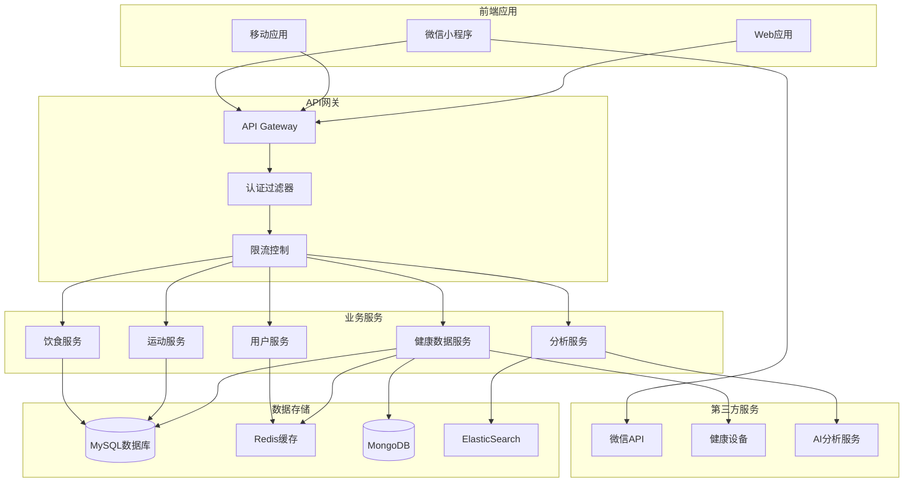

# 🏥 JOSP-Healthy - 健康管理系统


## 📖 项目简介

JOSP-Healthy是一个综合性的健康管理系统,提供健康数据记录、健康指标分析、运动计划制定、饮食建议等功能,帮助用户管理个人健康。

## 🏗️ 系统架构



## 🚀 快速开始

### 环境要求

- JDK 17+
- Node.js 16+
- MySQL 8.0+
- Redis 6.0+
- MongoDB 5.0+

### 安装步骤

```bash
# 1. 克隆项目
git clone https://github.com/yourusername/JOSP-healthy.git

# 2. 后端配置
cd JOSP-healthy/backend
# 修改 src/main/resources/application.yml
spring:
  datasource:
    url: jdbc:mysql://localhost:3306/healthy_system
    username: root
    password: your_password

# 3. 初始化数据库
mysql -u root -p < db/schema.sql

# 4. 启动后端
mvn spring-boot:run

# 5. 前端配置
cd ../frontend
npm install

# 6. 启动前端
npm run dev
```

## 🛠️ 技术栈

### 后端技术

| 技术 | 版本 | 说明 |
|------|------|------|
| Spring Boot | 3.x | 应用框架 |
| Spring Security | 3.x | 安全框架 |
| MyBatis | 3.5+ | ORM框架 |
| MySQL | 8.0+ | 关系数据库 |
| MongoDB | 5.0+ | 文档数据库 |
| Redis | 6.0+ | 缓存数据库 |
| ElasticSearch | 8.x | 搜索引擎 |

### 前端技术

| 技术 | 版本 | 说明 |
|------|------|------|
| Vue.js | 3.x | 前端框架 |
| Element Plus | 2.x | UI组件库 |
| Axios | - | HTTP客户端 |
| ECharts | 5.x | 图表库 |

## 📁 项目结构

```
JOSP-healthy/
├── backend/                    # 后端项目
│   ├── src/
│   │   ├── main/
│   │   │   ├── java/
│   │   │   │   └── com/josp/healthy/
│   │   │   │       ├── controller/      # 控制器层
│   │   │   │       ├── service/         # 业务逻辑层
│   │   │   │       ├── mapper/          # 数据访问层
│   │   │   │       ├── entity/          # 实体类
│   │   │   │       ├── dto/             # 数据传输对象
│   │   │   │       ├── config/          # 配置类
│   │   │   │       ├── security/        # 安全配置
│   │   │   │       └── utils/           # 工具类
│   │   │   └── resources/
│   │   │       ├── mapper/              # MyBatis映射文件
│   │   │       └── application.yml      # 配置文件
│   │   └── test/                        # 测试代码
│   └── pom.xml                          # Maven配置
├── frontend/                   # 前端项目
│   ├── src/
│   │   ├── views/              # 页面组件
│   │   ├── components/         # 公共组件
│   │   ├── api/                # API接口
│   │   ├── store/              # 状态管理
│   │   ├── router/             # 路由配置
│   │   └── utils/              # 工具函数
│   └── package.json            # 依赖配置
└── README.md                   # 项目说明
```

## 🔑 核心功能

### 健康数据管理

```java
@RestController
@RequestMapping("/api/health")
public class HealthController {
    
    @Autowired
    private HealthService healthService;
    
    @PostMapping("/records")
    public Result<HealthRecord> addRecord(@RequestBody HealthRecordDTO dto) {
        return Result.success(healthService.addHealthRecord(dto));
    }
    
    @GetMapping("/records/{userId}")
    public Result<List<HealthRecord>> getUserRecords(
        @PathVariable Long userId,
        @RequestParam(required = false) LocalDate startDate,
        @RequestParam(required = false) LocalDate endDate
    ) {
        return Result.success(healthService.getUserRecords(userId, startDate, endDate));
    }
    
    @GetMapping("/statistics/{userId}")
    public Result<HealthStatistics> getStatistics(@PathVariable Long userId) {
        return Result.success(healthService.calculateStatistics(userId));
    }
}
```

### 运动计划

```java
@Service
public class SportService {
    
    @Autowired
    private SportMapper sportMapper;
    
    @Autowired
    private AIService aiService;
    
    public SportPlan generatePlan(Long userId) {
        // 获取用户健康数据
        UserHealth userHealth = getUserHealthInfo(userId);
        
        // AI生成运动计划
        SportPlan plan = aiService.generateSportPlan(userHealth);
        
        // 保存计划
        sportMapper.insertPlan(plan);
        
        return plan;
    }
    
    public void recordSport(SportRecordDTO dto) {
        // 记录运动数据
        SportRecord record = new SportRecord();
        BeanUtils.copyProperties(dto, record);
        sportMapper.insertRecord(record);
        
        // 更新统计数据
        updateUserStatistics(dto.getUserId());
    }
}
```

### 饮食建议

```java
@Service
public class DietService {
    
    public DietSuggestion getDietSuggestion(Long userId) {
        // 获取用户信息
        User user = userService.getById(userId);
        UserHealth health = healthService.getLatestHealth(userId);
        
        // 计算每日所需热量
        double dailyCalories = calculateDailyCalories(user, health);
        
        // 生成饮食建议
        DietSuggestion suggestion = new DietSuggestion();
        suggestion.setDailyCalories(dailyCalories);
        suggestion.setBreakfast(generateMeal("breakfast", dailyCalories * 0.3));
        suggestion.setLunch(generateMeal("lunch", dailyCalories * 0.4));
        suggestion.setDinner(generateMeal("dinner", dailyCalories * 0.3));
        
        return suggestion;
    }
    
    private List<FoodRecommendation> generateMeal(String mealType, double calories) {
        // 根据热量生成食物推荐
        return foodRecommendMapper.selectByCalories(calories, mealType);
    }
}
```

### 健康分析

```java
@Service
public class AnalysisService {
    
    @Autowired
    private HealthMapper healthMapper;
    
    public HealthReport generateReport(Long userId) {
        // 获取历史数据
        List<HealthRecord> records = healthMapper.selectByUserId(userId);
        
        // 生成健康报告
        HealthReport report = new HealthReport();
        report.setUserId(userId);
        report.setReportDate(LocalDate.now());
        
        // BMI分析
        report.setBmiAnalysis(analyzeBMI(records));
        
        // 血压分析
        report.setBloodPressureAnalysis(analyzeBloodPressure(records));
        
        // 血糖分析
        report.setBloodSugarAnalysis(analyzeBloodSugar(records));
        
        // 运动分析
        report.setSportAnalysis(analyzeSport(records));
        
        // 健康建议
        report.setSuggestions(generateSuggestions(report));
        
        return report;
    }
}
```

## 📊 数据可视化

### 健康趋势图

```vue
<template>
  <div class="health-chart">
    <el-card>
      <template #header>
        <h3>健康数据趋势</h3>
      </template>
      <div ref="chartRef" style="height: 400px"></div>
    </el-card>
  </div>
</template>

<script setup>
import * as echarts from 'echarts'
import { onMounted } from 'vue'

const chartRef = ref()

onMounted(async () => {
  const chart = echarts.init(chartRef.value)
  
  const option = {
    title: { text: '健康指标趋势' },
    tooltip: { trigger: 'axis' },
    legend: { data: ['体重', '血压', '血糖'] },
    xAxis: { type: 'category', data: dates },
    yAxis: { type: 'value' },
    series: [
      {
        name: '体重',
        type: 'line',
        data: weightData
      },
      {
        name: '血压',
        type: 'line',
        data: bloodPressureData
      },
      {
        name: '血糖',
        type: 'line',
        data: bloodSugarData
      }
    ]
  }
  
  chart.setOption(option)
})
</script>
```

## 📊 API文档

### 健康数据API

| 接口 | 方法 | 路径 | 说明 |
|------|------|------|------|
| 添加记录 | POST | /api/health/records | 添加健康数据记录 |
| 获取记录 | GET | /api/health/records/{userId} | 获取用户健康记录 |
| 统计数据 | GET | /api/health/statistics/{userId} | 获取健康统计数据 |
| 生成报告 | GET | /api/health/report/{userId} | 生成健康报告 |

### 运动管理API

| 接口 | 方法 | 路径 | 说明 |
|------|------|------|------|
| 生成计划 | POST | /api/sport/plan/{userId} | 生成运动计划 |
| 记录运动 | POST | /api/sport/records | 记录运动数据 |
| 运动历史 | GET | /api/sport/records/{userId} | 获取运动历史 |

### 饮食管理API

| 接口 | 方法 | 路径 | 说明 |
|------|------|------|------|
| 饮食建议 | GET | /api/diet/suggestion/{userId} | 获取饮食建议 |
| 记录饮食 | POST | /api/diet/records | 记录饮食数据 |
| 营养分析 | GET | /api/diet/analysis/{userId} | 获取营养分析 |

## 🎯 核心特性

- **数据可视化**: 健康数据图表化展示
- **智能分析**: 基于AI的健康建议
- **多端支持**: Web、移动端、微信小程序
- **设备集成**: 支持智能健康设备数据接入
- **隐私保护**: 数据加密和权限控制

## 📝 更新日志

### v1.0.0 (2024-01-01)
- ✨ 初始版本发布
- ✨ 实现健康数据管理
- ✨ 实现运动计划制定
- ✨ 实现饮食建议功能
- ✨ 实现数据可视化

## 👥 贡献指南

欢迎贡献代码!请遵循以下步骤:

1. Fork本仓库
2. 创建特性分支 (`git checkout -b feature/AmazingFeature`)
3. 提交更改 (`git commit -m 'Add some AmazingFeature'`)
4. 推送到分支 (`git push origin feature/AmazingFeature`)
5. 提交Pull Request

## 📄 许可证

本项目采用 MIT 许可证 - 查看 [LICENSE](LICENSE) 文件了解详情

## 📮 联系方式

项目维护者: JOSP Team

---

⭐ 如果这个项目对你有帮助,欢迎Star支持!
